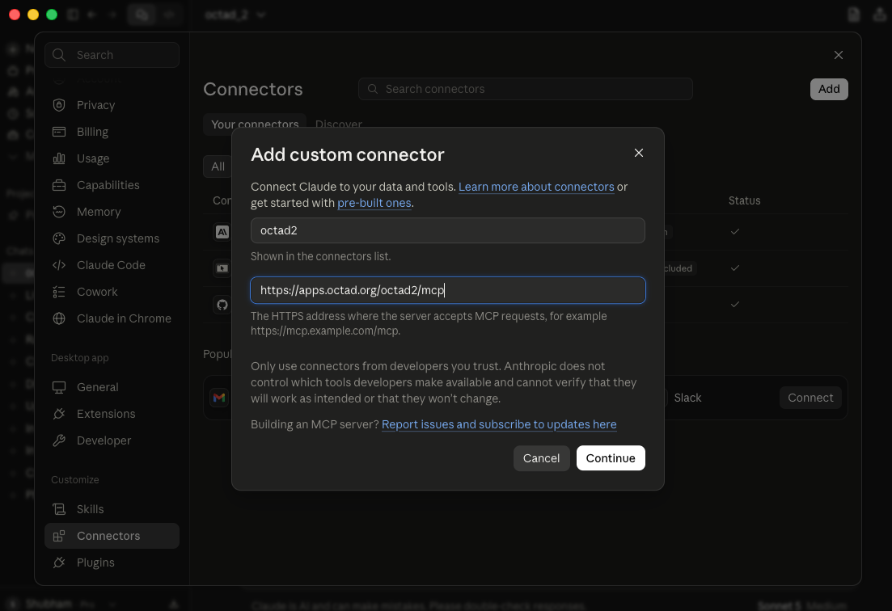
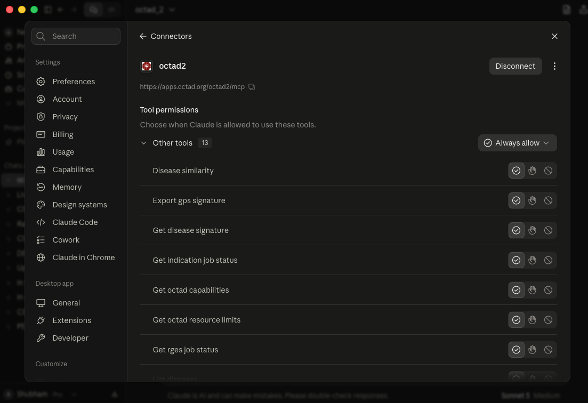
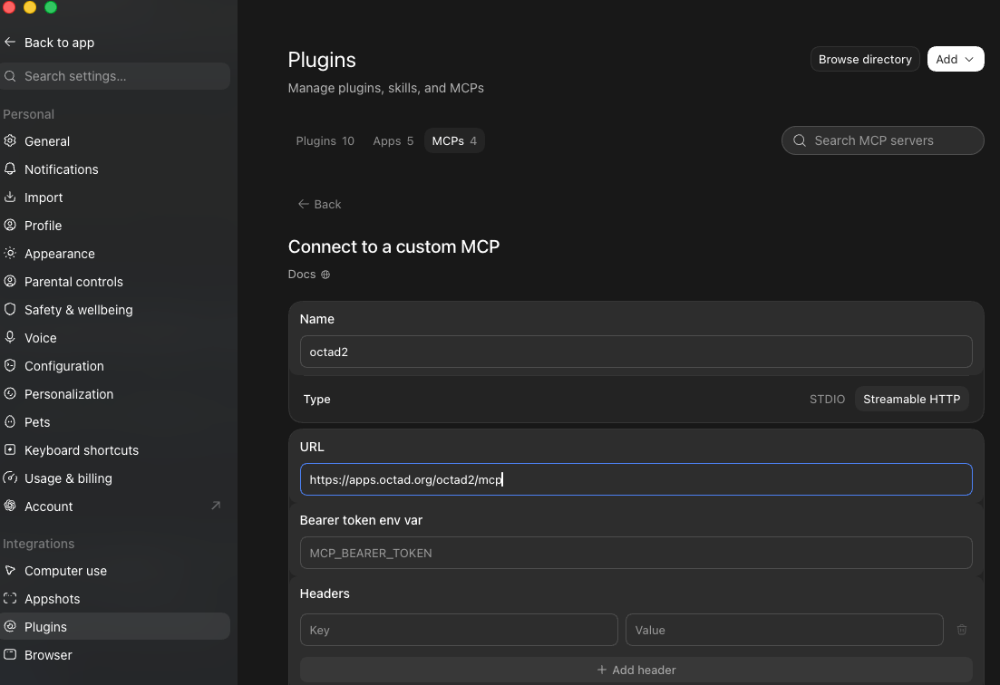
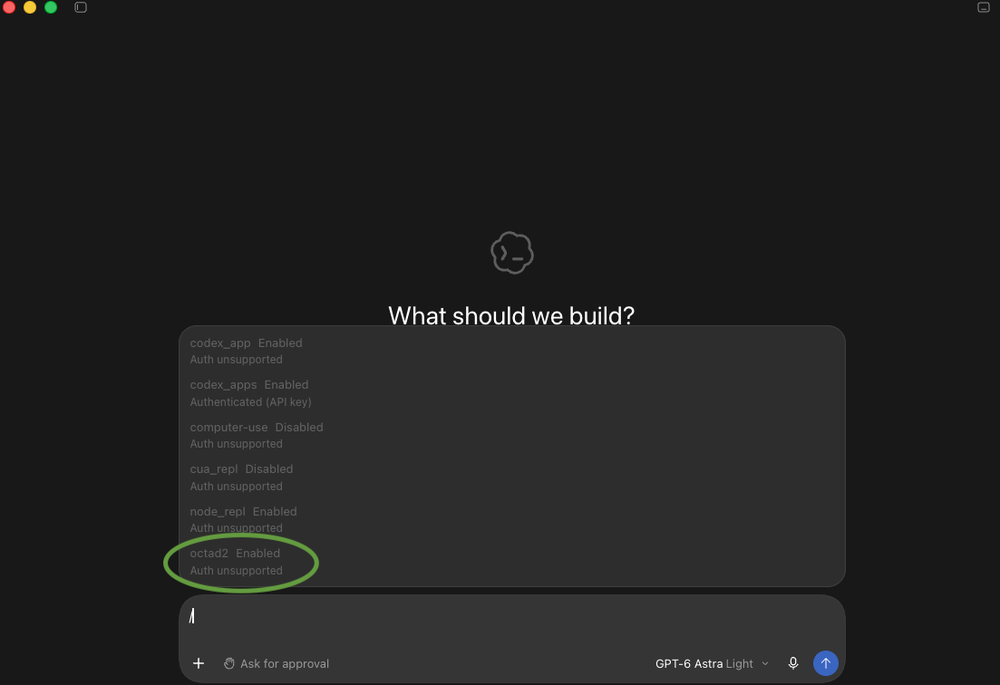
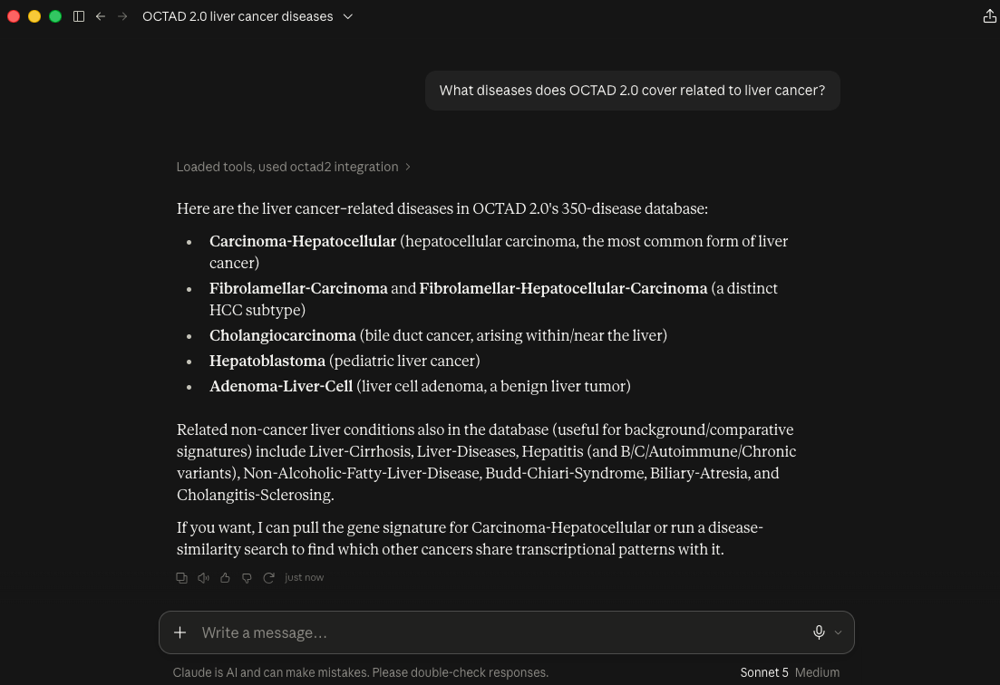
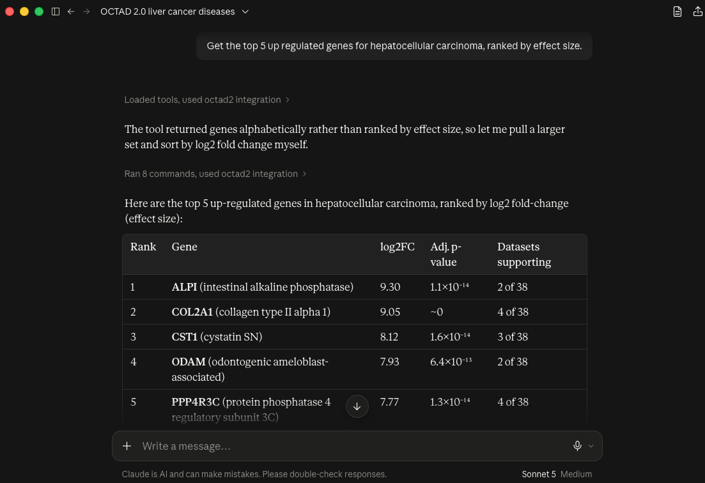
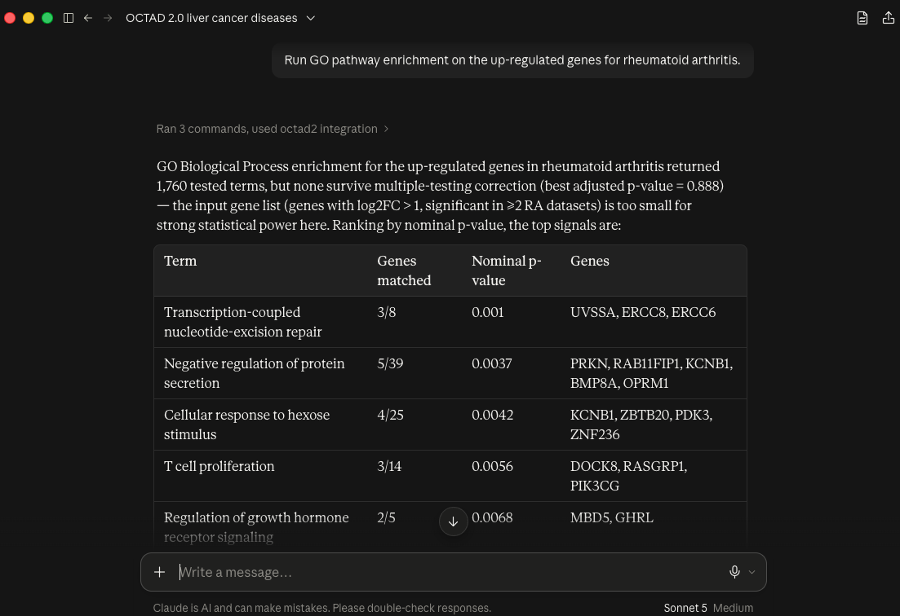
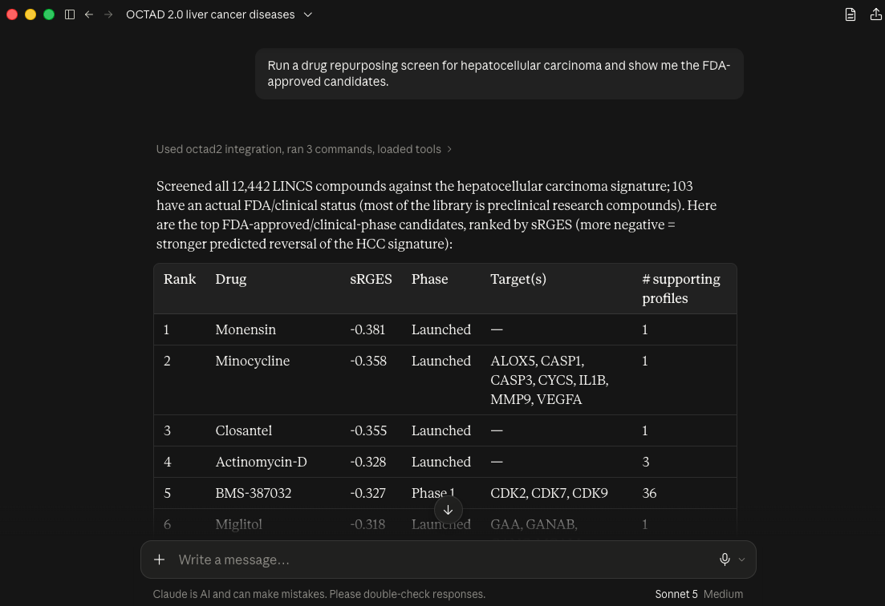

# OCTAD 2.0 MCP Server

Connect Claude, ChatGPT, or any [Model Context Protocol](https://modelcontextprotocol.io) client directly to **OCTAD 2.0** — a transcriptomics-based drug discovery platform covering disease signature exploration, disease-centric drug repurposing, and drug-centric indication expansion.

- **Portal:** https://apps.octad.org/octad2/
- **MCP endpoint:** `https://apps.octad.org/octad2/mcp`
- **Transport:** Streamable HTTP
- **Authentication:** None — this is a small, public, unauthenticated research API for the OCTAD community. Please be considerate of load.

No installation required. This is a **hosted, remote** MCP server — you just point your AI client at the URL above.

---

## What you can do with it

- Browse and search 350 diseases and ~980 RNA-seq signatures
- Pull the top up/down-regulated genes for any disease (meta-analyzed or single-dataset)
- Run GO / KEGG / Reactome / WikiPathways / MSigDB Hallmark pathway enrichment
- Screen ~12,400 LINCS compounds for their ability to reverse a disease's signature (RGES drug repurposing), with FDA/clinical-phase filtering
- Screen a drug's own gene signature against all 350 diseases to find new indications (indication expansion)
- Export any disease signature in [GPS](https://apps.octad.org/GPS/)-ready format

---

## Connect in Claude Desktop

1. Go to **Settings → Connectors**
2. Click **+** → **Add custom connector**
3. Name it (e.g. `octad2`) and paste the server URL: `https://apps.octad.org/octad2/mcp`
4. Leave **Advanced settings** empty — no OAuth Client ID/Secret needed
5. Click **Add**

<!-- TODO: screenshot of the "Add custom connector" dialog filled in -->


Claude should detect **"No sign-in"** authentication automatically. Start a new conversation and the tools are available.

By default, Claude asks for approval before each tool call. For smoother use, open the connector (**Settings → Connectors → octad2**) and set **Other tools → Always allow**, so Claude can browse diseases, run signature lookups, and score repurposing candidates without pausing for confirmation each time.

<!-- TODO: screenshot of the connected connector's tool list / permissions page -->


---

## Connect in Codex (ChatGPT) desktop

1. Open **Settings → Plugins → Add → Add MCP server**
2. Name it `octad2`
3. Choose **Streamable HTTP** as the type
4. Paste the server URL: `https://apps.octad.org/octad2/mcp`
5. Click **Save**, then restart the app

<!-- TODO: screenshot of the "Connect to a custom MCP" form filled in -->


To confirm it's connected, type `/mcp` in the chat, click **MCP**, and check that `octad2` shows as **Enabled**.

<!-- TODO: screenshot of the /mcp panel showing octad2 enabled -->


---

## Available tools

| Tool | Type | What it does |
|---|---|---|
| `get_octad_capabilities` | instant | Overview: modules, disease/signature/drug counts |
| `get_octad_resource_limits` | instant | Usage limits and expected runtimes |
| `list_diseases` | instant | All 350 disease names |
| `list_tissues` | instant | All tissue/organ labels for tissue-restricted screening |
| `search_gene` | instant | Where a gene is up/down-regulated across all diseases |
| `get_disease_signature` | instant | Top up/down genes for one disease |
| `pathway_enrichment` | instant | GO/KEGG/Reactome/WikiPathways/Hallmark enrichment |
| `export_gps_signature` | instant | GPS-ready two-column export (GeneSymbol, Value) |
| `start_rges_job` | async, 1–3 min | Start a drug repurposing (RGES) screen |
| `get_rges_job_status` | poll | Check/retrieve RGES results; `fda_only=True` filters to approved/clinical-phase drugs |
| `start_indication_job` | async, 1–2 min | Start an indication-expansion screen from a drug's gene signature |
| `get_indication_job_status` | poll | Check/retrieve indication-expansion results |

The two long-running analyses (RGES scoring, indication expansion) are **asynchronous**: the `start_*` tool returns a `job_id` immediately, and the assistant polls `get_*_job_status(job_id)` until it's done — you don't need to do anything differently, the AI client handles the polling loop on its own.

---

## Example prompts

These work the same way in Claude or ChatGPT once the connector is added — just ask naturally, the assistant picks the right tools.

**Explore a disease**
> What diseases does OCTAD 2.0 cover related to liver cancer?

<!-- TODO: screenshot of a real Claude conversation running this example -->


> Get the top 5 up-regulated genes for hepatocellular carcinoma, ranked by effect size.

<!-- TODO: screenshot of a real Claude conversation running this example -->


**Pathway interpretation**
> Run GO pathway enrichment on the up-regulated genes for rheumatoid arthritis.

<!-- TODO: screenshot of a real Claude conversation running this example -->


**Drug repurposing**
> Run a drug repurposing screen for hepatocellular carcinoma and show me the FDA-approved candidates.

<!-- TODO: screenshot of a real Claude conversation running this example -->


**Indication expansion (drug → disease direction)**
> Here's a gene signature for [drug X]: [up genes] / [down genes]. Which diseases would this most likely help treat?

**Multi-step research**
> Get the gene signature for hepatocellular carcinoma, run pathway enrichment on the up-regulated genes, then screen for drug repurposing candidates that could reverse it.

---

## Architecture

```
Claude / ChatGPT  ──Streamable HTTP──▶  MCP server (Python, FastMCP)
                                              │  HTTP
                                              ▼
                                    Plumber REST API (R)
                                              │
                                              ▼
                                     octad_core.R (shared logic)
                                              │
                                              ▼
                              Signature files + octad/octad.db (LINCS L1000)
```

The MCP server is a thin translation layer — every tool call is an HTTP request to a REST API, which shares its core scoring/analysis logic with the [OCTAD 2.0 web portal](https://apps.octad.org/octad2/). Both front doors run the exact same underlying code, so results are always consistent between the portal and the MCP tools.

---

## Notes

- This is a research tool for hypothesis generation, not a source of clinical or treatment recommendations. sRGES and other scores reflect computational signature-reversal, not clinical efficacy.
- No API key or account required — please use responsibly given shared server resources.
- Found a bug or have a feature request? Open an issue on this repository.

## Related

- [OCTAD 2.0 Portal](https://apps.octad.org/octad2/) — full-featured web interface for all of the above, plus interactive visualization
- [GPS Platform](https://apps.octad.org/GPS/) — de novo compound screening from chemical structure
- [OCTAD publication](https://www.nature.com/articles/s41596-020-00430-z) — Zeng et al., Nature Protocols 2021
